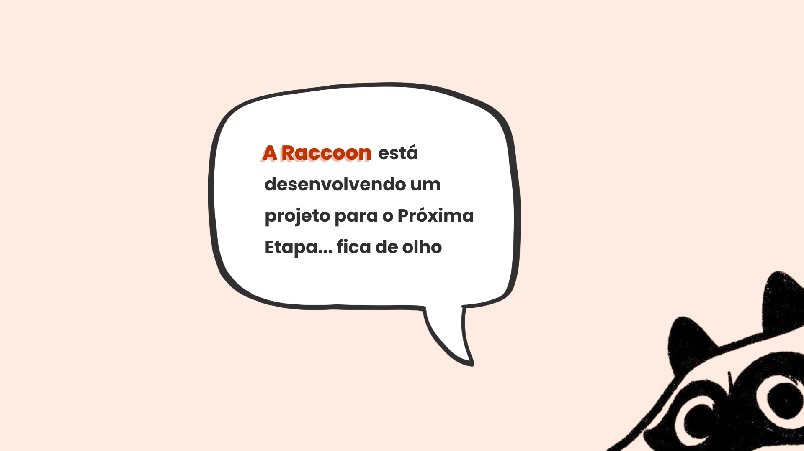

# FECAP - Fundação de Comércio Álvares Penteado

# Conecta Jovem

## <b>RACCOON</b>

## Integrantes: <a href="https://www.linkedin.com/in/%C3%A1lvaro-palazzin-053784271/">Álvaro Carvalho</a>, <a href="https://www.linkedin.com/in/dandaramonike/">Dandara Monike</a>, <a href="https://www.linkedin.com/in/leonardo-lamari-1b1464382/">Leonardo Lamari</a>, <a href="https://www.linkedin.com/in/luccas-covre/">Luccas Covre</a>

## Professores Orientadores: <a href="https://www.linkedin.com/in/francisco-escobar/">Francisco Escobar</a>, <a href="https://www.linkedin.com/in/rodrigo-da-rosa-phd ">Rodrigo Rosa</a>, <a href="https://www.linkedin.com/in/francisco-escobar/">Francisco Escobar</a>, <a href="https://www.linkedin.com/in/jefferson-o-silva">Jefferson Silva</a>, <a href="https://www.linkedin.com/in/aimarlopes">Aimar Martins Lopes</a>

## Descrição

   
  Desenvolvido por <a href="">Raccoon</a> | 
  <a rel="license" href="https://creativecommons.org/licenses/by-sa/3.0/">CC BY-SA 3.0</a> | 
  <a href="http://pix4free.org/">Pix4free</a>

De um a dois parágrafos sobre o que é seu projeto e o que ele faz.
  
Meu projeto ajuda estudantes FECAP a configurarem seus githubs.
  
May the force be with you!
  

## 🛠 Estrutura de pastas

<b>-Raiz</b> 
<b>|-->documentos</b> 
  &emsp;|-->Documentação.docx 
<b>|-->executáveis</b> 
  &emsp;|-->android 
<b>|-->imagens</b> 
<b>|-->src</b> 
  &emsp;|-->Backend 
  &emsp;|-->Frontend 
<b>|-->README.md</b> 

## 🛠 Instalação

<b>Android:</b>

Faça o Download do APP.apk no seu celular.  
Execute o APK e siga as instruções de seu telefone.

 

## 💻 Configuração para Desenvolvimento

Descrição de como instalar / Para abrir este projeto você necessita das seguintes ferramentas:   <b>(a incluir)</b>

 

## 📋 Licença/License

   
  <strong>ConectaJovem © 2026</strong>  
  Desenvolvido por: <a href="https://github.com/DandaraDandara">Dandara Monike</a>, <a href="https://github.com/alvaro2003">Álvaro Carvalho</a>, <a href="https://github.com/LeonardoLamar12">Leonardo Lamari</a> e <a href="https://github.com/LuccasCovre">Luccas Covre</a>

  
   
  <small>Este trabalho está licenciado sob uma <a rel="license" href="http://creativecommons.org/licenses/by-nd/4.0/">Licença CC BY-ND 4.0</a></small>

 

## 🎓 Referências

Aqui estão as referências usadas no projeto.

1. <https://github.com/fecaphub/Template_PI>
